## test_npu_anthropic_server.py

Anthropic Messages API

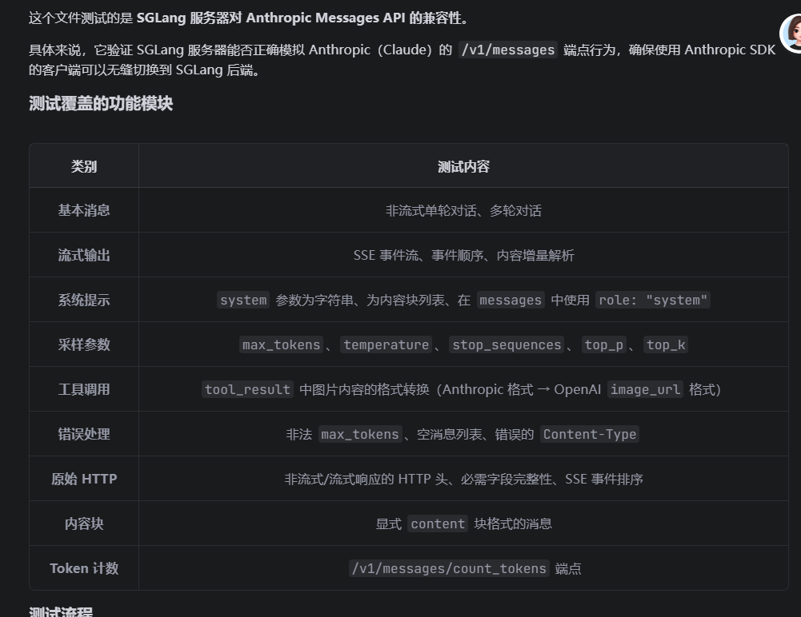


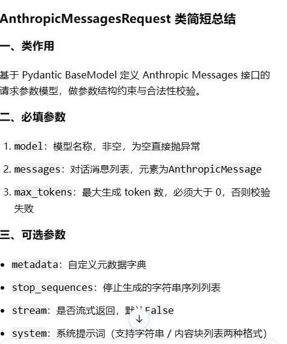


```
校验 Anthropic 接口中工具返回的图片块，可正常转换为 OpenAI 格式的image_url内容。
核心步骤
构造 Anthropic 请求：用户提问→助手调用read_file工具读取图片→用户携带 Base64 格式图片的tool_result工具返回结果。
通过转换方法将 Anthropic 请求转为 OpenAI ChatCompletion 请求。
校验要点
转换后仅生成 1 条 tool 角色消息；
工具调用 ID 匹配call_123；
消息内容为数组，且包含 1 条类型为image_url的数据；
Base64 图片数据正确拼接为data:image/png;base64,abcd格式链接。
```


```
def test_in_messages_system_role(self):
```

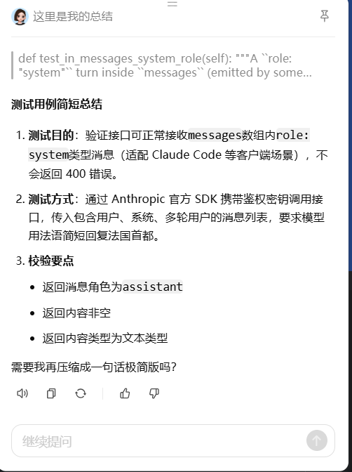

stop_seque

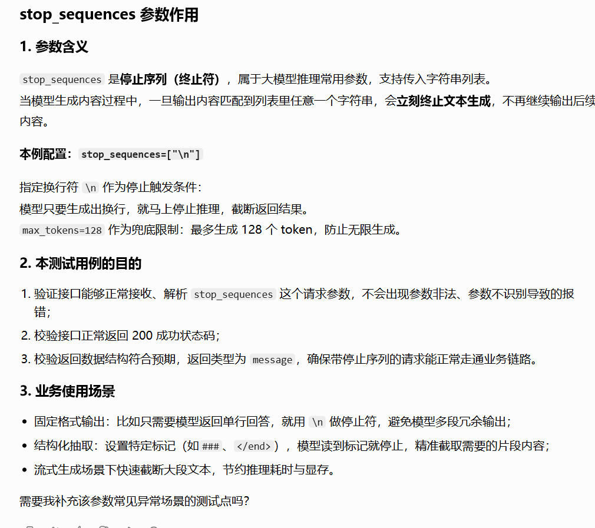

top_k

top

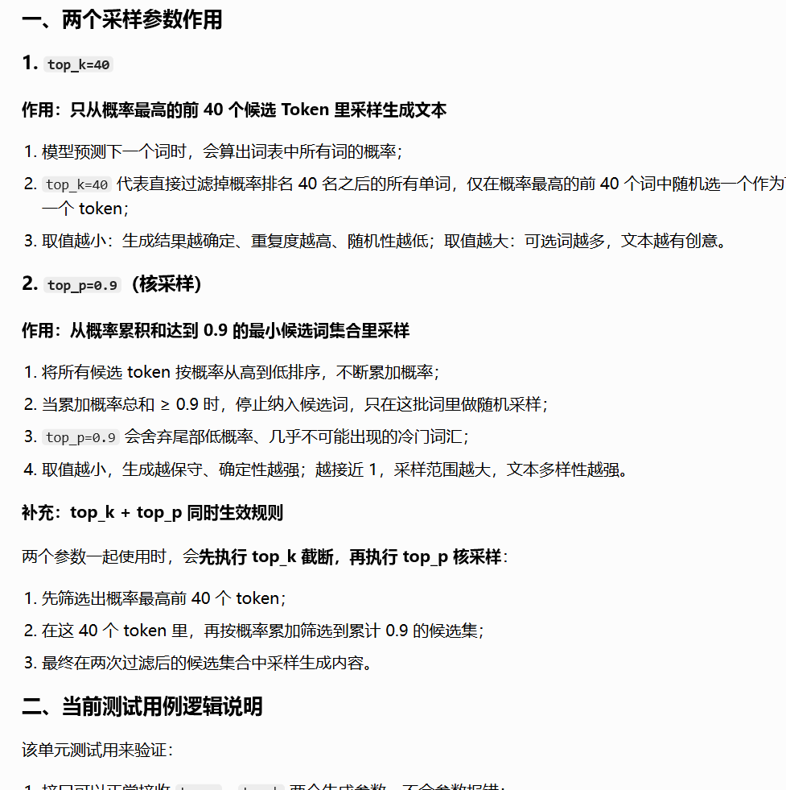


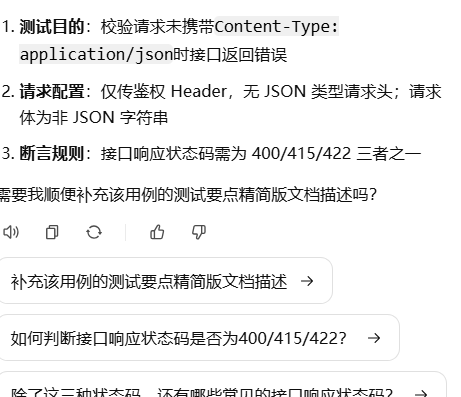


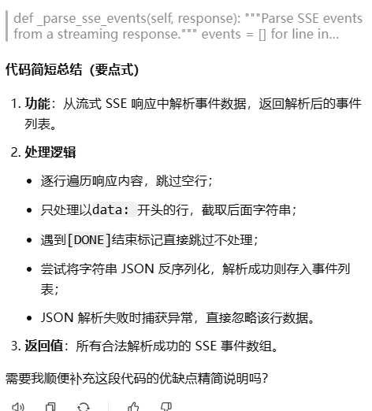


## test_npu_lora_qwen3_8b_logprob_diff

## 1. test_auto_detect_lora_target_modules
验证 auto_detect_lora_target_modules 函数能否正确识别 Qwen3-8B 架构中应该应用 LoRA 的模块。期望检测到的模块集合为：

- qkv_proj （注意力层的 QKV 投影）
- o_proj （注意力层的输出投影）
- gate_up_proj （MLP 层的门控上投影）
- down_proj （MLP 层的下投影）
- lm_head （语言模型头部）
## 2. test_lora_qwen3_8b_logprob_accuracy（核心测试）
这个测试验证 SGLang 引擎在加载 LoRA 适配器后，生成的 logprob 是否与训练时的参考 logprob 足够接近。

测试流程：

1. 启动 SGLang 引擎，加载 Qwen3-8B 基础模型和 LoRA 适配器
2. 使用预存的测试数据（ compare_sample_train_data.pt ），包含：
   - tokens ：输入 token 序列
   - training_logprobs ：训练时记录的参考 logprob
   - sampling_logprobs ：采样时记录的 logprob
3. 分别获取基础模型和 LoRA 模型的 prompt logprobs
4. 计算三种 KL 散度（使用自定义的 kl_v2 函数）：
   - KL(orig_sampler, trainer) ：原始采样器 vs 训练参考
   - KL(sglang, trainer) ：SGLang LoRA vs 训练参考
   - KL(sglang, orig_sampler) ：SGLang LoRA vs 原始采样器
5. 断言 ： KL(sglang, trainer) 必须小于阈值 5e-3 ，证明 SGLang 的 LoRA 实现与训练时的 logprob 高度一致
简而言之 ：确保 SGLang 的 LoRA 推理实现是正确的，输出的 logprob 与训练时的结果差异在可接受范围内。


https://github.com/Ascend/sglang/actions/runs/28279686046/job/83792850599?pr=887

https://github.com/Ascend/sglang/actions/runs/28417213645/job/84202555130?pr=903

```
[2026-06-27 05:21:57] Scheduler hit an exception: Traceback (most recent call last):
  File "/sgl-workspace/sglang/python/sglang/srt/managers/scheduler.py", line 4213, in run_scheduler_process
    scheduler.run_event_loop()
  File "/sgl-workspace/sglang/python/sglang/srt/managers/scheduler.py", line 1486, in run_event_loop
    dispatch_event_loop(self)
  File "/sgl-workspace/sglang/python/sglang/srt/managers/scheduler.py", line 4078, in dispatch_event_loop
    scheduler.event_loop_overlap()
  File "/usr/local/python3.11.15/lib/python3.11/site-packages/torch/utils/_contextlib.py", line 124, in decorate_context
    return func(*args, **kwargs)
           ^^^^^^^^^^^^^^^^^^^^^
  File "/sgl-workspace/sglang/python/sglang/srt/managers/scheduler.py", line 1556, in event_loop_overlap
    batch_result = self.run_batch(batch)
                   ^^^^^^^^^^^^^^^^^^^^^
  File "/sgl-workspace/sglang/python/sglang/srt/utils/nvtx_utils.py", line 109, in wrapper
    return func(*args, **kwargs)
           ^^^^^^^^^^^^^^^^^^^^^
  File "/sgl-workspace/sglang/python/sglang/srt/managers/scheduler.py", line 3185, in run_batch
    batch_result = self.model_worker.forward_batch_generation(
                   ^^^^^^^^^^^^^^^^^^^^^^^^^^^^^^^^^^^^^^^^^^^
  File "/sgl-workspace/sglang/python/sglang/srt/managers/tp_worker.py", line 500, in forward_batch_generation
    out = self.model_runner.forward(
          ^^^^^^^^^^^^^^^^^^^^^^^^^^
  File "/sgl-workspace/sglang/python/sglang/srt/model_executor/model_runner.py", line 2912, in forward
    output = self._forward_raw(
             ^^^^^^^^^^^^^^^^^^
  File "/sgl-workspace/sglang/python/sglang/srt/model_executor/model_runner.py", line 3038, in _forward_raw
    ret = self.eager_runner.execute(
          ^^^^^^^^^^^^^^^^^^^^^^^^^^
  File "/sgl-workspace/sglang/python/sglang/srt/model_executor/runner/eager_runner.py", line 256, in execute
    return self._execute_extend(forward_batch, pp_proxy_tensors)
           ^^^^^^^^^^^^^^^^^^^^^^^^^^^^^^^^^^^^^^^^^^^^^^^^^^^^^
  File "/sgl-workspace/sglang/python/sglang/srt/model_executor/runner/eager_runner.py", line 404, in _execute_extend
    ret = model_runner.model.forward(
          ^^^^^^^^^^^^^^^^^^^^^^^^^^^
  File "/usr/local/python3.11.15/lib/python3.11/site-packages/torch/utils/_contextlib.py", line 124, in decorate_context
    return func(*args, **kwargs)
           ^^^^^^^^^^^^^^^^^^^^^
  File "/sgl-workspace/sglang/python/sglang/srt/models/qwen3.py", line 539, in forward
    return self.logits_processor(
           ^^^^^^^^^^^^^^^^^^^^^^
  File "/usr/local/python3.11.15/lib/python3.11/site-packages/torch/nn/modules/module.py", line 1776, in _wrapped_call_impl
    return self._call_impl(*args, **kwargs)
           ^^^^^^^^^^^^^^^^^^^^^^^^^^^^^^^^
  File "/usr/local/python3.11.15/lib/python3.11/site-packages/torch/nn/modules/module.py", line 1787, in _call_impl
    return forward_call(*args, **kwargs)
           ^^^^^^^^^^^^^^^^^^^^^^^^^^^^^
  File "/sgl-workspace/sglang/python/sglang/srt/layers/logits_processor.py", line 401, in forward
    input_logits = logits[input_logprob_indices]
                   ~~~~~~^^^^^^^^^^^^^^^^^^^^^^^
RuntimeError: The Inner error is reported as above. The process exits for this inner error, and the current working operator name is _sgemm_lora_b_kernel.
Since the operator is called asynchronously, the stacktrace may be inaccurate. If you want to get the accurate stacktrace, please set the environment variable ASCEND_LAUNCH_BLOCKING=1.
Note: ASCEND_LAUNCH_BLOCKING=1 will force ops to run in synchronous mode, resulting in performance degradation. Please unset ASCEND_LAUNCH_BLOCKING in time after debugging.
Error:  2026-06-27-05:21:57 (PID:1084, Device:0, RankID:-1) ERR00100 PTA call acl api failed.
[PID: 1084] 2026-06-27-05:21:57.281.309 Invalid_Argument(EE1003): KernelLaunch failed because value 67716 for parameter coreDim is invalid. Expected value: less than or equal to 65535.
        Solution: 1.Check the input parameter range of the function. 2.Check the function invocation relationship.
        TraceBack (most recent call last):
        The argument is invalid.Reason: rtKernelLaunch execution failed.
```

```
coreDim 是昇腾 NPU 内核调度时的硬件核心维度参数，用来指定当前算子任务在 NPU 上并行调度的任务分片数、核并行维度大小，属于昇腾算子编译 / 任务下发阶段的硬件约束参数。
简单理解：
你给算子设置了并行任务数量 = 67716，但昇腾硬件 + 驱动限制：coreDim 最大只能 ≤ 65535，数值超限直接触发 EE1003 Invalid_Argument 内核启动失败。
约束来源
昇腾架构下，coreDim 采用 16 位无符号整型存储，取值范围：0 ~ 65535，超过 65535 就会参数非法。
二、为什么你这里出现 67716
常见几种场景：
算子网格维度（Grid Size）设置过大
推理 / 训练时，某个自定义算子、FlashAttention、Conv、MatMul、Embedding、KV 相关算子，Grid 并行维度算出来是 67716，直接赋值给了 coreDim。
sglang/vLLM 推理预填充 / 解码阶段，批量 + 序列长度太大
总并行调度维度 = 批量数 × 序列分片数，结果超出 65535 上限。
多进程 spawn + 大 batch 长序列测试场景
单元测试里超大输入长度、超大批量，导致算子并行维度溢出。
三、解决方案
方案 1：对超大并行维度做分片（最常用）
将总并行任务数做切分，单次下发的 coreDim 强制不超过 65535：
plaintext
总任务数 = 67716
分片次数 = ceil(67716 / 65535) = 2次
第1次 coreDim = 65535
第2次 coreDim = 67716 - 65535 = 2181
方案 2：调整推理框架参数（sglang 场景优先）
调小批量并行维度：max_batch_size、prefill_chunk_size、num_tokens 限制单轮调度 token 总数
开启算子网格自动分片（Ascend ATB/ACL 框架开启动态分片）
开启SPLIT_GRID_DIM类环境变量，让驱动自动拆分超限的 coreDim
方案 3：单元测试侧规避
你的测试用例不要构造极端超长序列、超大 batch 输入，把输入长度、批量缩小，避免单次算子并行维度溢出 65535。
四、临时环境规避（昇腾常用）
设置环境变量让 ACL 自动切分超限网格维度：
bash
运行
export ASCEND_GRID_DIM_SPLIT_ENABLE=1
该参数开启后，当coreDim>65535时，驱动会自动拆分成多次内核调用，绕过 16 位数值上限限制。
```


```
Hugging Face Dataset 数据集仓库，所有者：yushengsu，仓库名：lora-diff-Qwen3-8B，专门配套 SGLang Qwen3-8B LoRA 精度回归测试 使用。
2. 仓库内必备文件（由测试代码可确定）
LoRA 适配器权重文件
adapter_config.json：LoRA 超参配置（r=32、target_modules、alpha、dropout 等）
adapter_model.bin / adapter_model.safetensors：Qwen3-8B 训练产出的低秩微调矩阵
基准校验数据文件
compare_sample_train_data.pt（核心校验张量文件）
存储字段：tokens（测试输入 token 序列）、training_logprobs（训练框架标准 logprob 真值）、sampling_logprobs（原始训练采样输出 logprob）
作用：作为真值基准，对比 SGLang 昇腾推理输出的 LoRA logprob，通过自定义 MSE-KL 指标判定精度是否达标
```


# 代码逐行解析 + 功能梳理 + 关键要点说明


### opherlie/lora-test-case-Qwen3.5-4B 仓库完整内容

#### 总概

- 分支：`main`
- 总大小：约 **142.49 MB**
- 仓库类型：**Qwen3.5-4B 模型 LoRA 微调权重仓库**（不是原始训练数据集，是 LoRA 适配器权重）

#### 全部文件清单

1. `.gitattributes`（2504 B）

   Git 配置文件，用于 Hugging Face 仓库大文件 LFS 追踪配置。

2. `adapter_config.json`（736 B）

   LoRA 配置文件，记录微调超参：

   - LoRA 秩、alpha 缩放系数

   - 目标微调模块（q_proj、v_proj 等）

   - 基础模型名称、精度、是否开启 bias 微调等参数

     

     加载 LoRA 时必须读取该文件。

3. `adapter_model.safetensors`（145.89 MB）

   LoRA 权重二进制文件（safetensors 安全格式），存储微调后的低秩矩阵参数，是本仓库核心文件，用于挂载到 Qwen3.5-4B 基座模型做推理。

4. `compare_sample_train_data.pt`（23.29 KB）

   PyTorch 格式训练样本文件，存储部分训练用的样本张量数据，用于微调前后效果对比、测试验证，并非完整训练数据集。

#### 仓库用途说明

该仓库并非训练数据集仓库，而是**LoRA 微调后的适配器权重仓库**：

- 用来给 Qwen3.5-4B 基座模型加载微调后的低秩权重做推理测试；
- 附带少量训练样本 pt 文件，用于测试、复现微调效果、对比训练前后输出差异；
- 无 csv/jsonl 等常规训练数据集文件，所以数据集预览功能无法打开。


核心目标：校验 LoRA 加载后模型输出的 token 对数概率（logprob）和训练侧参考数据的一致性，防止框架改动导致 LoRA 精度退化，同时附带 LoRA 目标层自动探测的单元校验。

## 一、文件头部：版权、许可证、文档说明

```
# Copyright 2023-2025 SGLang Team
# Licensed under the Apache License, Version 2.0 (the "License");
# you may not use this file except in compliance with the License.
# ==============================================================================

"""
Regression test for Qwen3-8B LoRA logprob accuracy.
对比 SGLang LoRA 推理得到的 logprob 和训练阶段预存的参考 logprob，验证精度。
LoRA 权重+测试数据集从指定 HuggingFace Dataset 仓库拉取
Usage: python -m unittest test_lora_qwen3_8b_logprob_diff
"""
```

- Apache 2.0 开源协议声明，SGLang 官方测试脚本
- 测试类型：**回归测试（Regression Test）**，用于迭代升级框架后防止 LoRA 精度退化
- 测试原理：通过 KL 散度（自定义均方误差版）衡量推理 logprob 和训练参考 logprob 的偏差

## 二、依赖导入

```
import multiprocessing as mp
import os
import unittest
from unittest.mock import patch

import torch
import torch.nn as nn
from huggingface_hub import snapshot_download

import sglang as sgl
from sglang.srt.lora.utils import auto_detect_lora_target_modules
from sglang.test.ci.ci_register import register_cuda_ci
from sglang.test.test_utils import CustomTestCase
```

1. `unittest + patch`：Python 原生单元测试 + 模块 Mock 打桩，用于模拟模型结构做静态校验
2. `torch`：张量、logprob 数值计算、加载本地测试数据集
3. `snapshot_download`：拉取 HF 仓库的 LoRA 适配器 + 参考 logprob 数据集
4. `auto_detect_lora_target_modules`：SGLang LoRA 核心工具函数 —— 自动识别需要注入 LoRA 的线性层
5. `register_cuda_ci`：CI 流水线注册，声明该测试属于 CUDA 流水线（这里实际跑昇腾 NPU）、预估耗时、GPU 资源规格、所属测试阶段

## 三、全局常量配置

```
register_cuda_ci(est_time=40, stage="extra-a", runner_config="1-gpu-large")

BASE_MODEL = "/hoem/weights/Qwen/Qwen3-8B"
LORA_HF_REPO = "/hoem/weights/lora-diff-Qwen3-8B"
LORA_BACKEND = "triton"
MAX_LORA_RANK = 32
TP_SIZE = 1
PREFILL_ATTENTION_BACKEND = "ascend"
DECODE_ATTENTION_BACKEND = "ascend"

KL_THRESHOLD = 5e-3
```

### CI 注册参数

- `est_time=40`：预估测试耗时 40 秒
- `stage="extra-a"`：属于扩展测试阶段，非核心必跑冒烟用例
- `runner_config="1-gpu-large"`：需要单卡大显存硬件环境（适配昇腾大卡）

### 模型 & LoRA 配置

- 基座模型：本地路径 Qwen3-8B
- LoRA 仓库：本地挂载的 HF Dataset 仓库，存放 LoRA 权重 + `compare_sample_train_data.pt` 参考数据
- LoRA 后端：triton 算子实现；最大 LoRA 秩 32
- TP 张量并行：单卡 TP=1
- 前后 attention 后端统一指定 `ascend`：**昇腾 NPU 专用推理后端**
- 精度阈值：自定义 KL 指标上限 `0.005`，超过则判定 LoRA 精度不合格

## 四、自定义 KL 损失函数（误差衡量）

python


运行


```
def kl_v2(a, b):
    a = torch.tensor(a) if not torch.is_tensor(a) else a
    b = torch.tensor(b) if not torch.is_tensor(b) else b
    return (((a - b) ** 2) * 0.5).mean().item()
```

⚠️ 注意：这**不是标准 KL 散度**，是简化版**均方误差 MSE 变体**

公式：\(Loss = \frac{1}{2} \cdot \mathbb{E}[(a-b)^2]\)

作用：量化两组 logprob 分布之间的数值偏差，用来判定 SGLang LoRA 推理结果和训练侧是否对齐。

## 五、工具函数：获取输入序列每个 token 的对数概率

python


运行


```
def get_prompt_logprobs(engine, input_ids, lora_path):
    out = engine.generate(
        input_ids=input_ids,
        sampling_params={"max_new_tokens": 0, "temperature": 0.0},
        return_logprob=True,
        logprob_start_len=0,
        lora_path=lora_path,
    )
    return [logprob for logprob, _, _ in out["meta_info"]["input_token_logprobs"]][1:]
```

### 关键参数解释

1. `max_new_tokens=0`：**只做预填充推理，不生成新 token**，仅计算输入每个 token 的前置 logprob
2. `temperature=0.0`：确定性采样，不随机
3. `return_logprob=True`：开启返回每个输入 token 的预测对数概率
4. `logprob_start_len=0`：从第 0 个 token 开始全部返回 logprob
5. `lora_path=None`：跑基座模型 baseline；传入 LoRA 别名则加载 LoRA 推理
6. 返回切片 `[1:]`：跳过 BOS 起始 token 的 logprob，只取真实输入文本 token

## 六、Mock 模型结构：模拟 Qwen3-8B 网络结构

python


运行


```
class _MockLinearBase(nn.Module): pass
class _MockFusedMoE(nn.Module): pass
class _MockParallelLMHead(nn.Module): pass

def _build_qwen3_mock():
    """构建轻量化模拟模型，还原 Qwen3-8B 模块命名层级"""
    model = nn.Module()
    inner = nn.Module()
    layer = nn.Module()

    attn = nn.Module()
    attn.qkv_proj = _MockLinearBase()
    attn.o_proj = _MockLinearBase()
    layer.self_attn = attn

    mlp = nn.Module()
    mlp.gate_up_proj = _MockLinearBase()
    mlp.down_proj = _MockLinearBase()
    layer.mlp = mlp

    inner.layers = nn.ModuleList([layer])
    inner.embed_tokens = nn.Embedding(10, 8)  # Embedding 不属于 LinearBase，不注入LoRA
    model.model = inner
    model.lm_head = _MockParallelLMHead()
    return model
```

### 设计目的

1. 模拟 SGLang 中 Qwen3 稠密模型的标准线性层命名：`qkv_proj/o_proj/gate_up_proj/down_proj/lm_head`
2. `embed_tokens` 是 Embedding 层，不属于 `LinearBase`，会被自动过滤，不做 LoRA 微调
3. 配合 `unittest.mock.patch` 替换真实基类，**不用加载大模型就能离线校验 LoRA 目标层自动探测逻辑**，属于轻量静态单元测试。

## 七、测试用例类：继承 SGLang 自定义测试基类

python


运行


```
class TestLoRAQwen3_8BLogprobDiff(CustomTestCase):
```

包含两个测试方法：

1. `test_auto_detect_lora_target_modules`：LoRA 目标层自动探测正确性（离线 Mock 测试）
2. `test_lora_qwen3_8b_logprob_accuracy`：端到端 LoRA 推理精度回归测试（需要真实模型 + 昇腾硬件）

### 用例 1：LoRA 目标层自动探测校验

python


运行


```
def test_auto_detect_lora_target_modules(self):
    """校验Qwen3稠密模型下LoRA自动探测能正确识别所有需要微调的线性层"""
    model = _build_qwen3_mock()

    with (
        patch("sglang.srt.layers.linear.LinearBase", _MockLinearBase),
        patch("sglang.srt.layers.moe.fused_moe_triton.layer.FusedMoE", _MockFusedMoE),
        patch("sglang.srt.layers.vocab_parallel_embedding.ParallelLMHead", _MockParallelLMHead),
    ):
        detected = auto_detect_lora_target_modules(model)

    expected = {"qkv_proj", "o_proj", "gate_up_proj", "down_proj", "lm_head"}
    self.assertEqual(detected, expected)
```

- 通过 `patch` 将框架内真实层类替换为我们的 Mock 类，模拟真实模型扫描逻辑
- 断言：自动探测出的 LoRA 目标层必须和 Qwen3 预设集合完全一致
- 防护场景：后续框架重构修改层命名、封装基类后，自动探测失效会直接触发测试失败，提前拦截 Bug

### 用例 2：端到端 LoRA logprob 精度回归（核心业务测试）

python


运行


```
def test_lora_qwen3_8b_logprob_accuracy(self):
    # 1. 下载LoRA适配器+参考数据集
    adapter_path = snapshot_download(LORA_HF_REPO, repo_type="dataset")
    
    # 2. 初始化SGLang昇腾推理引擎，预注册LoRA
    engine = sgl.Engine(
        model_path=BASE_MODEL,
        tp_size=TP_SIZE,
        enable_lora=True,
        max_lora_rank=MAX_LORA_RANK,
        lora_paths={"my_lora": adapter_path},
        lora_backend=LORA_BACKEND,
        attention_backend="ascend",
        prefill_attention_backend=PREFILL_ATTENTION_BACKEND,
        decode_attention_backend=DECODE_ATTENTION_BACKEND,
    )

    try:
        # 3. 加载预存参考数据：输入token序列、训练侧logprob、原始采样logprob
        cdata = torch.load(
            os.path.join(adapter_path, "compare_sample_train_data.pt"),
            weights_only=False,
        )

        # 4. 分别跑基座模型、LoRA微调模型，获取输入token logprob
        base_logprobs = get_prompt_logprobs(engine, cdata["tokens"], lora_path=None)
        logprobs = get_prompt_logprobs(engine, cdata["tokens"], lora_path="my_lora")

        # 5. 统计基座与LoRA的logprob绝对偏差，打印指标
        base_t = torch.tensor(base_logprobs)
        lora_t = torch.tensor(logprobs)
        diff = (base_t - lora_t).abs()
        print(...)

        # 断言1：LoRA必须改变原始模型输出概率，不能和基座完全一致
        self.assertFalse(torch.equal(base_t, lora_t), "LoRA logprobs should differ from base model logprobs")

        # 6. 计算三组MSE-KL偏差
        kl_sglang_trainer = kl_v2(cdata["training_logprobs"], logprobs)
        kl_orig_trainer = kl_v2(cdata["training_logprobs"], cdata["sampling_logprobs"])
        kl_sglang_orig = kl_v2(logprobs, cdata["sampling_logprobs"])

        # 7. 核心精度断言：SGLang LoRA推理logprob相对训练参考的误差必须小于阈值5e-3
        self.assertLessEqual(kl_sglang_trainer, KL_THRESHOLD, "...")

    finally:
        # 无论测试成功失败，强制关闭引擎释放NPU资源
        engine.shutdown()
```

#### 测试流程拆解

1. 从本地 HF Dataset 拉取 LoRA 权重与测试张量文件
2. 启动 SGLang 昇腾推理引擎，开启 LoRA 功能，预加载 LoRA 适配器并命名为 `my_lora`
3. 加载预先生成的测试样本：输入 token id、训练框架输出的标准 logprob、原始采样 logprob
4. 两次推理：
   - 不带 LoRA：基座 baseline logprob
   - 绑定 LoRA：微调后模型 logprob
5. 基础校验：LoRA 必须改变模型概率分布，不能和基座完全相同
6. 计算三组误差：
   - `KL(sglang, trainer)`：SGLang LoRA 结果 vs 训练标准结果（核心校验指标）
   - `KL(orig_sampler, trainer)`：原始训练采样 vs 训练标准（基线参考）
   - `KL(sglang, orig_sampler)`：SGLang vs 原始训练采样
7. 核心断言：SGLang LoRA 与训练参考的 MSE 误差 ≤ 0.005，否则测试失败
8. `finally` 块保证引擎正常关闭，释放昇腾设备显存、进程资源

## 八、程序入口：多进程 + 单元测试执行 + 显存清理

python


运行


```
if __name__ == "__main__":
    try:
        mp.set_start_method("spawn")
    except RuntimeError:
        pass

    try:
        unittest.main(warnings="ignore", verbosity=2)
    finally:
        if torch.cuda.is_available():
            torch.cuda.empty_cache()
            torch.cuda.synchronize()
```

1. 设置多进程启动方式为 `spawn`：适配 SGLang TP 张量并行多进程场景，避免 fork 导致的权重拷贝、昇腾上下文异常
2. 忽略警告，详细日志模式执行所有单元测试
3. 测试结束清空缓存、设备同步，防止显存泄漏影响后续 CI 任务

## 九、整体测试价值总结

1. **静态层探测测试**：防止模型层命名、基类重构导致 LoRA 自动适配失效，漏加微调层
2. **端到端精度回归**：保障 SGLang 在昇腾硬件下，LoRA 加载、权重融合、算子计算后的概率输出和训练框架对齐，避免数值溢出、算子精度缺陷、权重加载错误引发模型效果劣化
3. CI 流水线自动化守护：每次代码合入自动跑卡精度，提前拦截 LoRA 相关缺陷


## test_npu_lora_qwen3_vl_30b_a3b_instruct_logprob_diff

[test: add Qwen3-VL-30B-A3B-Instruct LoRA logprob accuracy test · Ascend/sglang@5a59d93](https://github.com/Ascend/sglang/actions/runs/28282859161/job/83801750255?pr=889)

```
Now this kernel is running on AiCpu.If you are more concerned about high-performance execution,please cast dtype to float32. (function operator())
[rank3]:[W627 07:56:14.645527594 ArgSortKernelNpuOpApi.cpp:41] Warning: Warning: kernel [ArgSort] can not support dtype int32 or int64 on AiCore, Now this kernel is running on AiCpu.If you are more concerned about high-performance execution,please cast dtype to float32. (function operator())
[rank2]:[W627 07:56:14.651688865 ArgSortKernelNpuOpApi.cpp:41] Warning: Warning: kernel [ArgSort] can not support dtype int32 or int64 on AiCore, Now this kernel is running on AiCpu.If you are more concerned about high-performance execution,please cast dtype to float32. (function operator())
[rank1]:[W627 07:56:14.741150049 ArgSortKernelNpuOpApi.cpp:41] Warning: Warning: kernel [ArgSort] can not support dtype int32 or int64 on AiCore, Now this kernel is running on AiCpu.If you are more concerned about high-performance execution,please cast dtype to float32. (function operator())
[2026-06-27 07:56:54 TP1] Scheduler hit an exception: Traceback (most recent call last):
  File "/sgl-workspace/sglang/python/sglang/srt/managers/scheduler.py", line 4197, in run_scheduler_process
    scheduler = Scheduler(
                ^^^^^^^^^^
  File "/sgl-workspace/sglang/python/sglang/srt/managers/scheduler.py", line 436, in __init__
    self.init_model_worker()
  File "/sgl-workspace/sglang/python/sglang/srt/managers/scheduler.py", line 872, in init_model_worker
    self.init_all_cuda_graphs()
  File "/sgl-workspace/sglang/python/sglang/srt/managers/scheduler.py", line 855, in init_all_cuda_graphs
    self.tp_worker.init_cuda_graphs()
  File "/sgl-workspace/sglang/python/sglang/srt/managers/tp_worker.py", line 344, in init_cuda_graphs
    self.model_runner.init_cuda_graphs(
  File "/sgl-workspace/sglang/python/sglang/srt/model_executor/model_runner.py", line 907, in init_cuda_graphs
    self.init_decode_cuda_graph()
  File "/sgl-workspace/sglang/python/sglang/srt/model_executor/model_runner.py", line 2560, in init_decode_cuda_graph
    self.decode_cuda_graph_runner = graph_runners[self.device](self)
                                    ^^^^^^^^^^^^^^^^^^^^^^^^^^^^^^^^
  File "/sgl-workspace/sglang/python/sglang/srt/hardware_backend/npu/graph_runner/npu_graph_runner.py", line 103, in __init__
    super().__init__(
  File "/sgl-workspace/sglang/python/sglang/srt/model_executor/runner/decode_cuda_graph_runner.py", line 355, in __init__
    self.capture()
  File "/sgl-workspace/sglang/python/sglang/srt/model_executor/runner/decode_cuda_graph_runner.py", line 692, in capture
    self._capture_one_stream()
  File "/sgl-workspace/sglang/python/sglang/srt/model_executor/runner/decode_cuda_graph_runner.py", line 743, in _capture_one_stream
    self.capture_one_shape(bs, forward, stream_idx, variant_label)
  File "/sgl-workspace/sglang/python/sglang/srt/model_executor/runner/decode_cuda_graph_runner.py", line 822, in capture_one_shape
    self.backend.capture_one(
  File "/sgl-workspace/sglang/python/sglang/srt/hardware_backend/npu/graph_runner/npu_cudagraph_backend.py", line 91, in capture_one
    forward_fn()
  File "/sgl-workspace/sglang/python/sglang/srt/model_executor/runner/decode_cuda_graph_runner.py", line 807, in run_once
    return forward(
           ^^^^^^^^
  File "/usr/local/python3.11.15/lib/python3.11/site-packages/torch/utils/_contextlib.py", line 124, in decorate_context
    return func(*args, **kwargs)
           ^^^^^^^^^^^^^^^^^^^^^
  File "/sgl-workspace/sglang/python/sglang/srt/models/qwen3_vl.py", line 1273, in forward
    hidden_states = general_mm_embed_routine(
                    ^^^^^^^^^^^^^^^^^^^^^^^^^
  File "/sgl-workspace/sglang/python/sglang/srt/managers/mm_utils.py", line 1139, in general_mm_embed_routine
    hidden_states = language_model(
                    ^^^^^^^^^^^^^^^
  File "/usr/local/python3.11.15/lib/python3.11/site-packages/torch/nn/modules/module.py", line 1776, in _wrapped_call_impl
    return self._call_impl(*args, **kwargs)
           ^^^^^^^^^^^^^^^^^^^^^^^^^^^^^^^^
  File "/usr/local/python3.11.15/lib/python3.11/site-packages/torch/nn/modules/module.py", line 1787, in _call_impl
    return forward_call(*args, **kwargs)
           ^^^^^^^^^^^^^^^^^^^^^^^^^^^^^
  File "/sgl-workspace/sglang/python/sglang/srt/models/qwen3_vl_moe.py", line 115, in forward
    hidden_states, residual = layer(
                              ^^^^^^
  File "/usr/local/python3.11.15/lib/python3.11/site-packages/torch/nn/modules/module.py", line 1776, in _wrapped_call_impl
    return self._call_impl(*args, **kwargs)
           ^^^^^^^^^^^^^^^^^^^^^^^^^^^^^^^^
  File "/usr/local/python3.11.15/lib/python3.11/site-packages/torch/nn/modules/module.py", line 1787, in _call_impl
    return forward_call(*args, **kwargs)
           ^^^^^^^^^^^^^^^^^^^^^^^^^^^^^
  File "/sgl-workspace/sglang/python/sglang/srt/models/qwen3_moe.py", line 847, in forward
    hidden_states = self.mlp(
                    ^^^^^^^^^
  File "/usr/local/python3.11.15/lib/python3.11/site-packages/torch/nn/modules/module.py", line 1776, in _wrapped_call_impl
    return self._call_impl(*args, **kwargs)
           ^^^^^^^^^^^^^^^^^^^^^^^^^^^^^^^^
  File "/usr/local/python3.11.15/lib/python3.11/site-packages/torch/nn/modules/module.py", line 1787, in _call_impl
    return forward_call(*args, **kwargs)
           ^^^^^^^^^^^^^^^^^^^^^^^^^^^^^
  File "/sgl-workspace/sglang/python/sglang/srt/models/qwen3_moe.py", line 299, in forward
    return self.forward_normal(
           ^^^^^^^^^^^^^^^^^^^^
  File "/sgl-workspace/sglang/python/sglang/srt/models/qwen3_moe.py", line 327, in forward_normal
    final_hidden_states = self.experts(hidden_states, topk_output)
                          ^^^^^^^^^^^^^^^^^^^^^^^^^^^^^^^^^^^^^^^^
  File "/usr/local/python3.11.15/lib/python3.11/site-packages/torch/nn/modules/module.py", line 1776, in _wrapped_call_impl
    return self._call_impl(*args, **kwargs)
           ^^^^^^^^^^^^^^^^^^^^^^^^^^^^^^^^
  File "/usr/local/python3.11.15/lib/python3.11/site-packages/torch/nn/modules/module.py", line 1787, in _call_impl
    return forward_call(*args, **kwargs)
           ^^^^^^^^^^^^^^^^^^^^^^^^^^^^^
  File "/sgl-workspace/sglang/python/sglang/srt/lora/layers.py", line 1032, in forward
    return self._forward_with_lora(hidden_states, topk_output, lora_info, **kwargs)
           ^^^^^^^^^^^^^^^^^^^^^^^^^^^^^^^^^^^^^^^^^^^^^^^^^^^^^^^^^^^^^^^^^^^^^^^^
  File "/sgl-workspace/sglang/python/sglang/srt/lora/layers.py", line 1066, in _forward_with_lora
    combine_input = self._lora_runner.run(
                    ^^^^^^^^^^^^^^^^^^^^^^
  File "/sgl-workspace/sglang/python/sglang/srt/layers/moe/moe_runner/runner.py", line 145, in run
    runner_input = self.pre_permute_func(
                   ^^^^^^^^^^^^^^^^^^^^^^
  File "/sgl-workspace/sglang/python/sglang/srt/layers/moe/moe_runner/triton.py", line 205, in pre_permute_standard_to_triton
    ) = _prepare_fused_moe_run(
        ^^^^^^^^^^^^^^^^^^^^^^^
  File "/sgl-workspace/sglang/python/sglang/srt/layers/moe/moe_runner/triton_utils/fused_moe.py", line 392, in _prepare_fused_moe_run
    sorted_token_ids, expert_ids, num_tokens_post_padded = moe_align_block_size(
                                                           ^^^^^^^^^^^^^^^^^^^^^
  File "/sgl-workspace/sglang/python/sglang/srt/layers/moe/moe_runner/triton_utils/moe_align_block_size.py", line 103, in moe_align_block_size
    sgl_moe_align_block_size(
    ^^^^^^^^^^^^^^^^^^^^^^^^
NameError: name 'sgl_moe_align_block_size' is not defined
```

## test_npu_lora_qwen3_30b_a3b_instruct_2507_logprob_diff

https://github.com/Ascend/sglang/actions/runs/28358828702/job/84008260007?pr=898

```
[rank1]:[W629 10:18:36.150242146 ArgSortKernelNpuOpApi.cpp:41] Warning: Warning: kernel [ArgSort] can not support dtype int32 or int64 on AiCore, Now this kernel is running on AiCpu.If you are more concerned about high-performance execution,please cast dtype to float32. (function operator())
[rank2]:[W629 10:18:36.155798618 ArgSortKernelNpuOpApi.cpp:41] Warning: Warning: kernel [ArgSort] can not support dtype int32 or int64 on AiCore, Now this kernel is running on AiCpu.If you are more concerned about high-performance execution,please cast dtype to float32. (function operator())
[rank3]:[W629 10:18:36.182132124 ArgSortKernelNpuOpApi.cpp:41] Warning: Warning: kernel [ArgSort] can not support dtype int32 or int64 on AiCore, Now this kernel is running on AiCpu.If you are more concerned about high-performance execution,please cast dtype to float32. (function operator())
[2026-06-29 10:19:13 TP3] Scheduler hit an exception: Traceback (most recent call last):
  File "/sgl-workspace/sglang/python/sglang/srt/managers/scheduler.py", line 4197, in run_scheduler_process
    scheduler = Scheduler(
                ^^^^^^^^^^
  File "/sgl-workspace/sglang/python/sglang/srt/managers/scheduler.py", line 436, in __init__
    self.init_model_worker()
  File "/sgl-workspace/sglang/python/sglang/srt/managers/scheduler.py", line 872, in init_model_worker
    self.init_all_cuda_graphs()
  File "/sgl-workspace/sglang/python/sglang/srt/managers/scheduler.py", line 855, in init_all_cuda_graphs
    self.tp_worker.init_cuda_graphs()
  File "/sgl-workspace/sglang/python/sglang/srt/managers/tp_worker.py", line 344, in init_cuda_graphs
    self.model_runner.init_cuda_graphs(
  File "/sgl-workspace/sglang/python/sglang/srt/model_executor/model_runner.py", line 907, in init_cuda_graphs
    self.init_decode_cuda_graph()
  File "/sgl-workspace/sglang/python/sglang/srt/model_executor/model_runner.py", line 2560, in init_decode_cuda_graph
    self.decode_cuda_graph_runner = graph_runners[self.device](self)
                                    ^^^^^^^^^^^^^^^^^^^^^^^^^^^^^^^^
  File "/sgl-workspace/sglang/python/sglang/srt/hardware_backend/npu/graph_runner/npu_graph_runner.py", line 103, in __init__
    super().__init__(
  File "/sgl-workspace/sglang/python/sglang/srt/model_executor/runner/decode_cuda_graph_runner.py", line 355, in __init__
    self.capture()
  File "/sgl-workspace/sglang/python/sglang/srt/model_executor/runner/decode_cuda_graph_runner.py", line 692, in capture
    self._capture_one_stream()
  File "/sgl-workspace/sglang/python/sglang/srt/model_executor/runner/decode_cuda_graph_runner.py", line 743, in _capture_one_stream
    self.capture_one_shape(bs, forward, stream_idx, variant_label)
  File "/sgl-workspace/sglang/python/sglang/srt/model_executor/runner/decode_cuda_graph_runner.py", line 822, in capture_one_shape
    self.backend.capture_one(
  File "/sgl-workspace/sglang/python/sglang/srt/hardware_backend/npu/graph_runner/npu_cudagraph_backend.py", line 91, in capture_one
    forward_fn()
  File "/sgl-workspace/sglang/python/sglang/srt/model_executor/runner/decode_cuda_graph_runner.py", line 807, in run_once
    return forward(
           ^^^^^^^^
  File "/usr/local/python3.11.15/lib/python3.11/site-packages/torch/utils/_contextlib.py", line 124, in decorate_context
    return func(*args, **kwargs)
           ^^^^^^^^^^^^^^^^^^^^^
  File "/sgl-workspace/sglang/python/sglang/srt/models/qwen3_moe.py", line 1002, in forward
    hidden_states = self.model(
                    ^^^^^^^^^^^
  File "/usr/local/python3.11.15/lib/python3.11/site-packages/torch/nn/modules/module.py", line 1776, in _wrapped_call_impl
    return self._call_impl(*args, **kwargs)
           ^^^^^^^^^^^^^^^^^^^^^^^^^^^^^^^^
  File "/usr/local/python3.11.15/lib/python3.11/site-packages/torch/nn/modules/module.py", line 1787, in _call_impl
    return forward_call(*args, **kwargs)
           ^^^^^^^^^^^^^^^^^^^^^^^^^^^^^
  File "/sgl-workspace/sglang/python/sglang/srt/models/qwen2_moe.py", line 925, in forward
    hidden_states, residual = layer(
                              ^^^^^^
  File "/usr/local/python3.11.15/lib/python3.11/site-packages/torch/nn/modules/module.py", line 1776, in _wrapped_call_impl
    return self._call_impl(*args, **kwargs)
           ^^^^^^^^^^^^^^^^^^^^^^^^^^^^^^^^
  File "/usr/local/python3.11.15/lib/python3.11/site-packages/torch/nn/modules/module.py", line 1787, in _call_impl
    return forward_call(*args, **kwargs)
           ^^^^^^^^^^^^^^^^^^^^^^^^^^^^^
  File "/sgl-workspace/sglang/python/sglang/srt/models/qwen3_moe.py", line 847, in forward
    hidden_states = self.mlp(
                    ^^^^^^^^^
  File "/usr/local/python3.11.15/lib/python3.11/site-packages/torch/nn/modules/module.py", line 1776, in _wrapped_call_impl
    return self._call_impl(*args, **kwargs)
           ^^^^^^^^^^^^^^^^^^^^^^^^^^^^^^^^
  File "/usr/local/python3.11.15/lib/python3.11/site-packages/torch/nn/modules/module.py", line 1787, in _call_impl
    return forward_call(*args, **kwargs)
           ^^^^^^^^^^^^^^^^^^^^^^^^^^^^^
  File "/sgl-workspace/sglang/python/sglang/srt/models/qwen3_moe.py", line 299, in forward
    return self.forward_normal(
           ^^^^^^^^^^^^^^^^^^^^
  File "/sgl-workspace/sglang/python/sglang/srt/models/qwen3_moe.py", line 327, in forward_normal
    final_hidden_states = self.experts(hidden_states, topk_output)
                          ^^^^^^^^^^^^^^^^^^^^^^^^^^^^^^^^^^^^^^^^
  File "/usr/local/python3.11.15/lib/python3.11/site-packages/torch/nn/modules/module.py", line 1776, in _wrapped_call_impl
    return self._call_impl(*args, **kwargs)
           ^^^^^^^^^^^^^^^^^^^^^^^^^^^^^^^^
  File "/usr/local/python3.11.15/lib/python3.11/site-packages/torch/nn/modules/module.py", line 1787, in _call_impl
    return forward_call(*args, **kwargs)
           ^^^^^^^^^^^^^^^^^^^^^^^^^^^^^
  File "/sgl-workspace/sglang/python/sglang/srt/lora/layers.py", line 1032, in forward
    return self._forward_with_lora(hidden_states, topk_output, lora_info, **kwargs)
           ^^^^^^^^^^^^^^^^^^^^^^^^^^^^^^^^^^^^^^^^^^^^^^^^^^^^^^^^^^^^^^^^^^^^^^^^
  File "/sgl-workspace/sglang/python/sglang/srt/lora/layers.py", line 1066, in _forward_with_lora
    combine_input = self._lora_runner.run(
                    ^^^^^^^^^^^^^^^^^^^^^^
  File "/sgl-workspace/sglang/python/sglang/srt/layers/moe/moe_runner/runner.py", line 145, in run
    runner_input = self.pre_permute_func(
                   ^^^^^^^^^^^^^^^^^^^^^^
  File "/sgl-workspace/sglang/python/sglang/srt/layers/moe/moe_runner/triton.py", line 205, in pre_permute_standard_to_triton
    ) = _prepare_fused_moe_run(
        ^^^^^^^^^^^^^^^^^^^^^^^
  File "/sgl-workspace/sglang/python/sglang/srt/layers/moe/moe_runner/triton_utils/fused_moe.py", line 392, in _prepare_fused_moe_run
    sorted_token_ids, expert_ids, num_tokens_post_padded = moe_align_block_size(
                                                           ^^^^^^^^^^^^^^^^^^^^^
  File "/sgl-workspace/sglang/python/sglang/srt/layers/moe/moe_runner/triton_utils/moe_align_block_size.py", line 103, in moe_align_block_size
    sgl_moe_align_block_size(
    ^^^^^^^^^^^^^^^^^^^^^^^^
NameError: name 'sgl_moe_align_block_size' is not defined
```

## test_lora_npu_qwen3_5_4b_logprob_diff

[test: add Qwen3.5-4B LoRA logprob accuracy test case · Ascend/sglang@f11e91d](https://github.com/Ascend/sglang/actions/runs/28372716447/job/84054317806?pr=902)

Invalid_Argument(EE1003): KernelLaunch failed because value 118340 for parameter coreDim is invalid. Expected value: less than or equal to 65535. 当前算子：_sgemm_lora_b_kernel（昇腾NPU下LoRA矩阵乘算子）

```
[2026-06-29 12:52:43] Scheduler hit an exception: Traceback (most recent call last):
  File "/sgl-workspace/sglang/python/sglang/srt/managers/scheduler.py", line 4213, in run_scheduler_process
    scheduler.run_event_loop()
  File "/sgl-workspace/sglang/python/sglang/srt/managers/scheduler.py", line 1486, in run_event_loop
    dispatch_event_loop(self)
  File "/sgl-workspace/sglang/python/sglang/srt/managers/scheduler.py", line 4078, in dispatch_event_loop
    scheduler.event_loop_overlap()
  File "/usr/local/python3.11.15/lib/python3.11/site-packages/torch/utils/_contextlib.py", line 124, in decorate_context
    return func(*args, **kwargs)
           ^^^^^^^^^^^^^^^^^^^^^
  File "/sgl-workspace/sglang/python/sglang/srt/managers/scheduler.py", line 1556, in event_loop_overlap
    batch_result = self.run_batch(batch)
                   ^^^^^^^^^^^^^^^^^^^^^
  File "/sgl-workspace/sglang/python/sglang/srt/utils/nvtx_utils.py", line 109, in wrapper
    return func(*args, **kwargs)
           ^^^^^^^^^^^^^^^^^^^^^
  File "/sgl-workspace/sglang/python/sglang/srt/managers/scheduler.py", line 3185, in run_batch
    batch_result = self.model_worker.forward_batch_generation(
                   ^^^^^^^^^^^^^^^^^^^^^^^^^^^^^^^^^^^^^^^^^^^
  File "/sgl-workspace/sglang/python/sglang/srt/managers/tp_worker.py", line 500, in forward_batch_generation
    out = self.model_runner.forward(
          ^^^^^^^^^^^^^^^^^^^^^^^^^^
  File "/sgl-workspace/sglang/python/sglang/srt/model_executor/model_runner.py", line 2912, in forward
    output = self._forward_raw(
             ^^^^^^^^^^^^^^^^^^
  File "/sgl-workspace/sglang/python/sglang/srt/model_executor/model_runner.py", line 3038, in _forward_raw
    ret = self.eager_runner.execute(
          ^^^^^^^^^^^^^^^^^^^^^^^^^^
  File "/sgl-workspace/sglang/python/sglang/srt/model_executor/runner/eager_runner.py", line 256, in execute
    return self._execute_extend(forward_batch, pp_proxy_tensors)
           ^^^^^^^^^^^^^^^^^^^^^^^^^^^^^^^^^^^^^^^^^^^^^^^^^^^^^
  File "/sgl-workspace/sglang/python/sglang/srt/model_executor/runner/eager_runner.py", line 404, in _execute_extend
    ret = model_runner.model.forward(
          ^^^^^^^^^^^^^^^^^^^^^^^^^^^
  File "/usr/local/python3.11.15/lib/python3.11/site-packages/torch/utils/_contextlib.py", line 124, in decorate_context
    return func(*args, **kwargs)
           ^^^^^^^^^^^^^^^^^^^^^
  File "/sgl-workspace/sglang/python/sglang/srt/models/qwen3_vl.py", line 1289, in forward
    return self.logits_processor(
           ^^^^^^^^^^^^^^^^^^^^^^
  File "/usr/local/python3.11.15/lib/python3.11/site-packages/torch/nn/modules/module.py", line 1776, in _wrapped_call_impl
    return self._call_impl(*args, **kwargs)
           ^^^^^^^^^^^^^^^^^^^^^^^^^^^^^^^^
  File "/usr/local/python3.11.15/lib/python3.11/site-packages/torch/nn/modules/module.py", line 1787, in _call_impl
    return forward_call(*args, **kwargs)
           ^^^^^^^^^^^^^^^^^^^^^^^^^^^^^
  File "/sgl-workspace/sglang/python/sglang/srt/layers/logits_processor.py", line 401, in forward
    input_logits = logits[input_logprob_indices]
                   ~~~~~~^^^^^^^^^^^^^^^^^^^^^^^
RuntimeError: The Inner error is reported as above. The process exits for this inner error, and the current working operator name is _sgemm_lora_b_kernel.
Since the operator is called asynchronously, the stacktrace may be inaccurate. If you want to get the accurate stacktrace, please set the environment variable ASCEND_LAUNCH_BLOCKING=1.
Note: ASCEND_LAUNCH_BLOCKING=1 will force ops to run in synchronous mode, resulting in performance degradation. Please unset ASCEND_LAUNCH_BLOCKING in time after debugging.
Error:  2026-06-29-12:52:43 (PID:1080, Device:0, RankID:-1) ERR00100 PTA call acl api failed.
[PID: 1080] 2026-06-29-12:52:43.622.198 Invalid_Argument(EE1003): KernelLaunch failed because value 118340 for parameter coreDim is invalid. Expected value: less than or equal to 65535.
        Solution: 1.Check the input parameter range of the function. 2.Check the function invocation relationship.
        TraceBack (most recent call last):
        The argument is invalid.Reason: rtKernelLaunch execution failed.
[2026-06-29 12:52:43] SIGQUIT received. signum=None, frame=None. It usually means one child failed.
[2026-06-29 12:52:48] Pyspy failed (py-spy dump --native --pid 1080). Error: Error: Failed to find a python interpreter in the .data section
[2026-06-29 12:52:48] Pyspy failed (py-spy dump  --pid 1080). Error: Error: Failed to find a python interpreter in the .data section
[2026-06-29 12:52:48] All pyspy dump attempts failed for PID 1080.
[2026-06-29 12:52:48] CUDA user-triggered coredump is not enabled. Set CUDA_ENABLE_USER_TRIGGERED_COREDUMP=1 before CUDA initialization.
[2026-06-29 12:52:48] CUDA coredump pipe not found for PID 1080: /__w/sglang/sglang/corepipe.cuda.linux-aarch64-a3-8-lhf2z-runner-wkc59-workflow.1080. Ensure CUDA_ENABLE_USER_TRIGGERED_COREDUMP=1 was set before this process initialized CUDA.
/__w/_temp/d4589253-0492-4604-9971-e728121c4355.sh: line 48:   925 Killed                  python -u ${sglang_source_path}/${test_case}
```

## test_npu_lora_qwen3_5_35b_a3b_logprob_diff


## test_npu_lora_radix_cache.py

[test: add LoRA radix cache test for NPU · Ascend/sglang@7494535](https://github.com/Ascend/sglang/actions/runs/28507955040/job/84500931668?pr=909)

--dtype half取值？

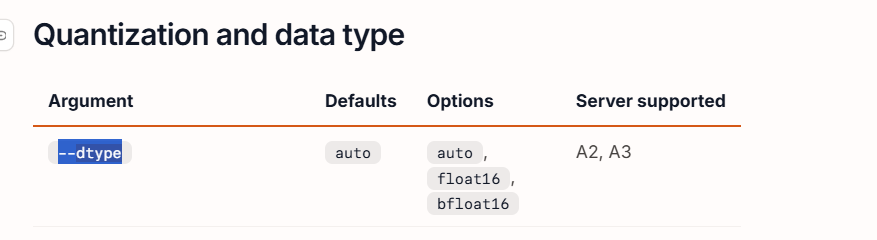

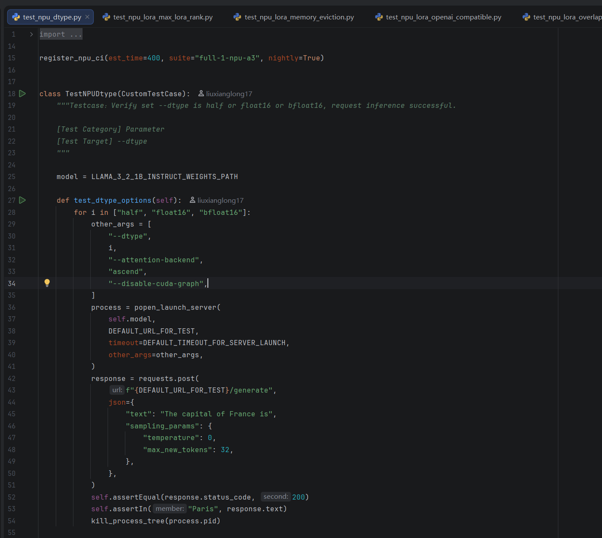


### HFRUnner

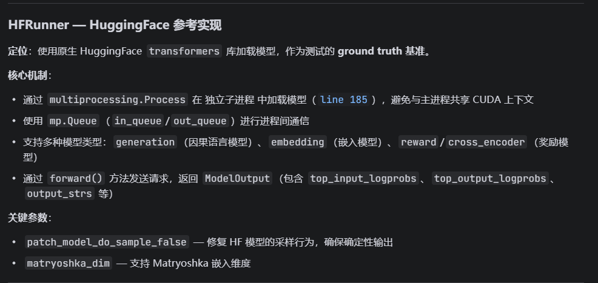

### SRTRunner

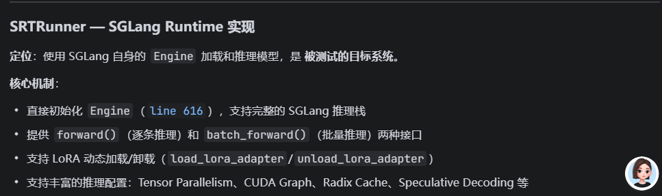


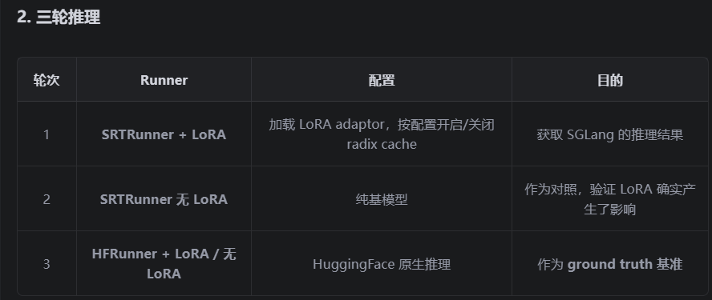


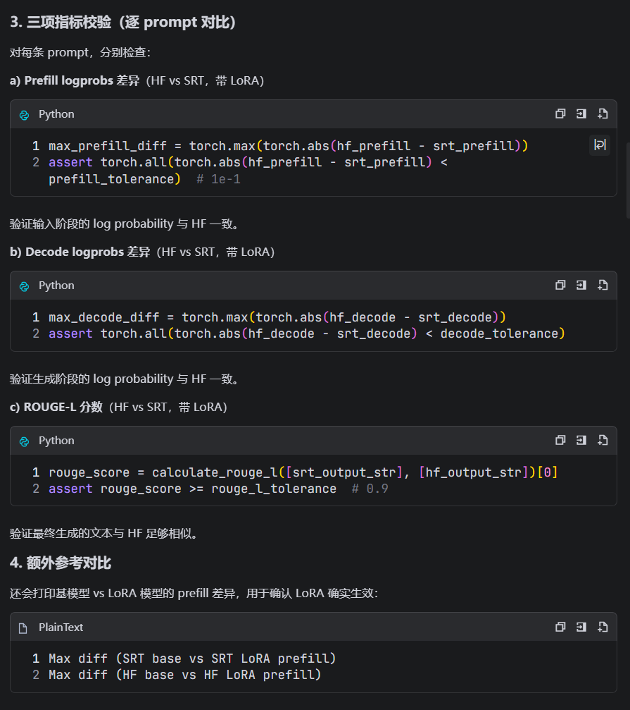


```
HFRunner:
  测试代码 → mp.Queue → 子进程 → transformers.AutoModelForCausalLM.generate()

SRTRunner:
  测试代码 → mp.Queue → 子进程 → SGLang Engine → (内部自研推理引擎)

Server:
  测试代码 → HTTP → 服务进程 → SGLang Engine → (内部自研推理引擎)
```


```
两者区别仅在于 Engine 外面包了什么 ：

- SRTRunner ：Engine 外面只包了一个 mp.Queue 通信层，测试代码直接调用 engine.forward()
- Server ：Engine 外面包了一个完整的 HTTP REST API 层 （FastAPI），通过 sglang serve 命令启动，对外暴露 OpenAI 兼容的 API 端点
所以 Server 不是使用某个 Runner，而是和 SRTRunner 共享同一个底层推理引擎 Engine ，只是访问方式不同：一个是进程内直接调用，一个是走 HTTP 网络请求。
```


```
```

https://github.com/Ascend/sglang/actions/runs/28508564460/job/84502965481?pr=912


## test_npu_qwen3_next_models

https://github.com/Ascend/sglang/actions/runs/28511576452/job/84512927976?pr=912

```
  0%|          | 0/13 [00:00<?, ?it/s]
Capturing batches (bs=70 avail_mem=9.63 GB):   0%|          | 0/13 [00:00<?, ?it/s]
Capturing batches (bs=70 avail_mem=9.63 GB):   0%|          | 0/13 [00:37<?, ?it/s]
[2026-07-01 10:48:55 TP2] Scheduler hit an exception: Traceback (most recent call last):
  File "/sgl-workspace/sglang/python/sglang/srt/model_executor/runner/decode_cuda_graph_runner.py", line 355, in __init__
    self.capture()
  File "/sgl-workspace/sglang/python/sglang/srt/model_executor/runner/decode_cuda_graph_runner.py", line 692, in capture
    self._capture_one_stream()
  File "/sgl-workspace/sglang/python/sglang/srt/model_executor/runner/decode_cuda_graph_runner.py", line 743, in _capture_one_stream
    self.capture_one_shape(bs, forward, stream_idx, variant_label)
  File "/sgl-workspace/sglang/python/sglang/srt/model_executor/runner/decode_cuda_graph_runner.py", line 838, in capture_one_shape
    self.backend.capture_one(
  File "/sgl-workspace/sglang/python/sglang/srt/hardware_backend/npu/graph_runner/npu_cudagraph_backend.py", line 91, in capture_one
    forward_fn()
  File "/sgl-workspace/sglang/python/sglang/srt/model_executor/runner/decode_cuda_graph_runner.py", line 807, in run_once
    out = forward(
          ^^^^^^^^
  File "/usr/local/python3.11.15/lib/python3.11/site-packages/torch/utils/_contextlib.py", line 124, in decorate_context
    return func(*args, **kwargs)
           ^^^^^^^^^^^^^^^^^^^^^
  File "/sgl-workspace/sglang/python/sglang/srt/models/qwen3_next.py", line 1075, in forward
    hidden_states = self.model(input_ids, positions, forward_batch, inputs_embeds)
                    ^^^^^^^^^^^^^^^^^^^^^^^^^^^^^^^^^^^^^^^^^^^^^^^^^^^^^^^^^^^^^^
  File "/usr/local/python3.11.15/lib/python3.11/site-packages/torch/nn/modules/module.py", line 1776, in _wrapped_call_impl
    return self._call_impl(*args, **kwargs)
           ^^^^^^^^^^^^^^^^^^^^^^^^^^^^^^^^
  File "/usr/local/python3.11.15/lib/python3.11/site-packages/torch/nn/modules/module.py", line 1787, in _call_impl
    return forward_call(*args, **kwargs)
           ^^^^^^^^^^^^^^^^^^^^^^^^^^^^^
  File "/sgl-workspace/sglang/python/sglang/srt/models/qwen3_next.py", line 959, in forward
    hidden_states, residual = layer(
                              ^^^^^^
  File "/usr/local/python3.11.15/lib/python3.11/site-packages/torch/nn/modules/module.py", line 1776, in _wrapped_call_impl
    return self._call_impl(*args, **kwargs)
           ^^^^^^^^^^^^^^^^^^^^^^^^^^^^^^^^
  File "/usr/local/python3.11.15/lib/python3.11/site-packages/torch/nn/modules/module.py", line 1787, in _call_impl
    return forward_call(*args, **kwargs)
           ^^^^^^^^^^^^^^^^^^^^^^^^^^^^^
  File "/sgl-workspace/sglang/python/sglang/srt/models/qwen3_next.py", line 863, in forward
    hidden_states = self.self_attention(
                    ^^^^^^^^^^^^^^^^^^^^
  File "/sgl-workspace/sglang/python/sglang/srt/models/qwen3_next.py", line 828, in self_attention
    attn_output = self.attn(q, k, v, forward_batch)
                  ^^^^^^^^^^^^^^^^^^^^^^^^^^^^^^^^^
  File "/usr/local/python3.11.15/lib/python3.11/site-packages/torch/nn/modules/module.py", line 1776, in _wrapped_call_impl
    return self._call_impl(*args, **kwargs)
           ^^^^^^^^^^^^^^^^^^^^^^^^^^^^^^^^
  File "/usr/local/python3.11.15/lib/python3.11/site-packages/torch/nn/modules/module.py", line 1787, in _call_impl
    return forward_call(*args, **kwargs)
           ^^^^^^^^^^^^^^^^^^^^^^^^^^^^^
  File "/sgl-workspace/sglang/python/sglang/srt/layers/radix_attention.py", line 145, in forward
    return get_attn_backend().forward(
           ^^^^^^^^^^^^^^^^^^^^^^^^^^^
  File "/sgl-workspace/sglang/python/sglang/srt/layers/attention/hybrid_linear_attn_backend.py", line 1120, in forward
    return self.forward_decode(
           ^^^^^^^^^^^^^^^^^^^^
  File "/sgl-workspace/sglang/python/sglang/srt/layers/attention/hybrid_linear_attn_backend.py", line 1050, in forward_decode
    return self.full_attn_backend.forward_decode(
           ^^^^^^^^^^^^^^^^^^^^^^^^^^^^^^^^^^^^^^
  File "/sgl-workspace/sglang/python/sglang/srt/hardware_backend/npu/attention/ascend_backend.py", line 2438, in forward_decode
    return self.forward_decode_graph(
           ^^^^^^^^^^^^^^^^^^^^^^^^^^
  File "/sgl-workspace/sglang/python/sglang/srt/hardware_backend/npu/attention/ascend_backend.py", line 2281, in forward_decode_graph
    workspace = torch_npu._npu_fused_infer_attention_score_get_max_workspace(
                ^^^^^^^^^^^^^^^^^^^^^^^^^^^^^^^^^^^^^^^^^^^^^^^^^^^^^^^^^^^^^
  File "/usr/local/python3.11.15/lib/python3.11/site-packages/torch/_ops.py", line 1209, in __call__
    return self._op(*args, **kwargs)
           ^^^^^^^^^^^^^^^^^^^^^^^^^
RuntimeError: operator():../third_party/op-plugin/op_plugin/ops/opapi/FusedInferAttentionScoreKernelNpuOpApi.cpp:615 NPU function error: call aclnnFusedInferAttentionScoreV3 failed, error code is 561002
```


b090

```
disable cuda graph
```

https://github.com/Ascend/sglang/actions/runs/28578892264/job/84734053109?pr=912


orgin

```
```

https://github.com/Ascend/sglang/actions/runs/28585877575/job/84757232780?pr=912


## 1. GSM8K 数学推理准确率测试 (GSM8KMixin)
源码 : eval_accuracy_kit.py

测试什么 : 用 GSM8K 数据集（小学数学应用题）评估模型的推理准确率。

流程 :

1. 先调用 /flush_cache 清空缓存
2. 通过 run_eval 对模型发起 OpenAI completion API 请求，5-shot 方式出题，每题最多生成 512 token
3. 默认跑 200 道题（ gsm8k_num_questions=200 ），128 线程并发
4. 计算准确率 score ，断言 score >= gsm8k_accuracy_thres （本例中 ≥ 0.93）
验证目的 : 确保模型在 Ascend NPU 上的推理结果与标准精度一致，没有因为硬件适配或并行策略导致精度劣化。

## 2. KL 散度测试 (KLDivergenceMixin)
源码 : kl_divergence_kit.py

测试什么 : 验证模型在 缓存命中 场景下输出的 logprobs 与无缓存时的一致性，用 KL 散度衡量。

包含 两个子测试 ：

- test_input_output_logprobs_match_prefill_cache_hit — Prefill 阶段缓存命中：先预填充一批文本让 KV cache 生成，再发送相同前缀的请求，比较命中部分 token 的 logprobs 是否一致。
- test_input_output_logprobs_match_decode_cache_hit — Decode 阶段缓存命中：在自回归解码过程中，验证缓存命中后生成的 token logprobs 与基准一致。
流程 :

1. 对模型发送请求，收集 input/output 的 logprobs
2. 计算两组 logprobs 分布之间的 KL 散度
3. 断言 KL 散度 ≤ kl_div_thres （本例中 ≤ 0.0025）
4. 最多采样 32 个样本（ kl_div_max_samples=32 ），每个样本生成 512 token
验证目的 : 确保 RadixTree/Prefix Cache 机制不会引入数值偏差——缓存命中时模型的输出分布应与无缓存时完全一致。

## 3. Prefix Cache 分支测试 (PrefixCacheBranchingMixin)
源码 : prefix_cache_branching_kit.py

测试什么 : 验证 RadixTree 前缀缓存在 分支场景 下的正确性——多个请求共享相同前缀、但后缀不同时，缓存的命中行为是否符合预期。

流程 （ cache_chunk_size=64 , branching_pos=257 ）:

1. 清空缓存
2. 构造前缀 "hi" * 257 （514 个 token），以及三个不同后缀：
   
   - 后缀1: "this" * 256
   - 后缀2: "here" * 256
   - 后缀3: "that" * 256
3. 第1个请求 （前缀+后缀1）：首次请求，无缓存 → 断言 cached_tokens == 0
4. 第2个请求 （前缀+后缀2）：前缀已缓存，但后缀不同。由于分支点在 257 位置，而缓存按 chunk（64 token）对齐，257 // 64 * 64 = 256，但此时前缀的后缀部分还没被缓存过 → 断言 cached_tokens == 0 （实际缓存了前缀但分支点尚未形成完整 chunk 命中）
5. 第3个请求 （前缀+后缀3）：此时分支点的缓存已经建立 → 断言 cached_tokens == 256 （即 257 // 64 * 64 = 256 个 token 命中缓存）
验证目的 : 确保 RadixTree 在处理共享前缀的分支请求时，能正确地按 chunk 粒度进行缓存匹配和命中，不会多匹配也不会漏匹配。

```

```


## test_lora_overlap_loading.py


float 16 ---》bfloat 16


## test_lora_radix_cache.py


## test_npu_lora_eviction


```
@contextlib.contextmanager
def dynamically_loaded_adapter(...):
    try:
        # 【进入with块：第一步执行】加载LoRA
        runner.load_lora_adapter(...)
        
        # ⭐ yield：暂停当前函数，把控制权交给 with 内部代码
        yield  

        # 【with代码块执行完毕后，恢复运行这里】
    finally:
        # 无论正常结束 / 抛出异常，都会执行卸载
        runner.unload_lora_adapter(...)
```


## 


test_npu_lora_tp


test_npu_lora_tied_lm_head


## test_npu_lora_tied_lm_head.py


## test_npu_lora_tp.py


## test_npu_lora_update.py


